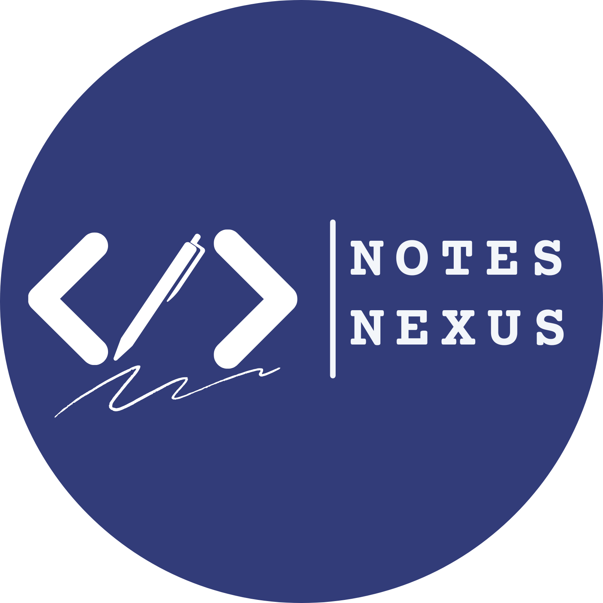

<p align="center">
  
</p>

<h1 align="center">Notes Nexus</h1>

<p align="center">
  <strong>Your JIS University Study Hub — Notes, PYQs &amp; Student Marketplace</strong>
</p>

<p align="center">
  <a href="https://notes-nexus-jisu.vercel.app">🌐 Live Site</a> &nbsp;·&nbsp;
  <a href="#features">✨ Features</a> &nbsp;·&nbsp;
  <a href="#tech-stack">🛠️ Tech Stack</a> &nbsp;·&nbsp;
  <a href="#contributing">🤝 Contributing</a>
</p>

<p align="center">
  
  
  
  
  
</p>

---

> **Disclaimer:** Notes Nexus is a **student-run, unofficial** initiative. It is not affiliated with or endorsed by JIS University.

## About

**Notes Nexus** is a free, open-source, university-wide platform where students can discover, share, and rate study materials. Whether you need lecture notes for your next exam, previous year question papers (PYQs) to practice, or a second-hand textbook from a senior — Notes Nexus has you covered.

### Departments Supported

| Department | Degree | Semesters |
|---|---|---|
| Computer Science & Engineering | B.Tech | 8 |
| Computer Applications | BCA | 8 |
| Pharmacy | B.Pharma | 8 |
| Pharmacy (PG) | M.Pharma | 4 |
| Law | BBA LL.B (Hons.) | 10 |
| Business Administration | BBA | 6 |
| Bioscience & Biotechnology | B.Sc / M.Sc | 6 |
| Physics | B.Sc / M.Sc | 6 |
| Mathematics | B.Sc / M.Sc | 6 |
| Education | B.Ed | 4 |

## Features

- 📚 **Lecture Notes** — Browse, search, and filter notes by department, semester, and subject. Sort by rating, newest, or most viewed.
- 📝 **Previous Year Questions (PYQs)** — Filter by Mid Sem / Final Sem and year to find exactly the paper you need.
- 🛒 **Student Marketplace** — Buy and sell second-hand books, drafters, lab instruments, and more with a built-in listing board.
- ⭐ **Ratings & Reviews** — Rate materials (1–5 stars) to surface the best content for your juniors.
- 📤 **Community Uploads** — Any verified student can contribute notes and PYQs. Every upload is admin-moderated before going live.
- 🔐 **Secure PDF Viewer** — In-app viewer with download deterrence so materials stay within the platform.
- 📱 **Mobile-First Design** — Fully responsive neo-brutalist UI built for phones, where most students browse.
- 🔍 **SEO Optimized** — Dynamic sitemap, Open Graph images, and structured data for every page.

## Tech Stack

| Layer | Technology |
|---|---|
| **Framework** | [Next.js 16](https://nextjs.org/) (App Router, React 19) |
| **Language** | TypeScript + JavaScript |
| **Styling** | [Tailwind CSS 4](https://tailwindcss.com/) |
| **Database & Auth** | [Supabase](https://supabase.com/) — PostgreSQL, Google OAuth, Row Level Security |
| **File & Image Storage** | [Cloudinary](https://cloudinary.com/) (PDFs, marketplace photos, optimized delivery) |
| **Animations** | [Framer Motion](https://www.framer.com/motion/) (lazy-loaded via `LazyMotion`) |
| **Analytics** | [Vercel Analytics](https://vercel.com/analytics) + [Speed Insights](https://vercel.com/docs/speed-insights) |
| **Deployment** | [Vercel](https://vercel.com/) |

## Project Structure

```
Notes_Nexus/
├── public/                  # Static assets (favicon, campus image)
├── src/
│   ├── app/                 # Next.js App Router pages
│   │   ├── notes/           # Notes browsing (dept → semester → paper)
│   │   ├── pyq/             # PYQ browsing (dept → semester → exam type)
│   │   ├── instruments/     # Student marketplace
│   │   ├── upload/          # Material upload form
│   │   ├── admin/           # Admin moderation dashboard
│   │   ├── me/              # User's uploads & listings
│   │   ├── about/           # Team & about page
│   │   └── api/             # Route handlers (upload, rate, admin actions)
│   ├── components/          # Reusable UI components
│   ├── config/              # Site config, departments, team roster
│   │   ├── site.ts          # Brand name, URLs, theme tokens
│   │   ├── departments.ts   # Department taxonomy
│   │   └── team.ts          # Team member data
│   └── lib/                 # Data fetching, auth, Supabase clients
│       ├── data/            # Server-side data access (materials, papers, departments)
│       ├── auth/            # Auth context & helpers
│       └── supabase/        # Supabase client configs (server, client, admin, middleware)
├── supabase/
│   └── migrations/          # SQL schema migrations
├── middleware.ts             # Route protection (/upload, /me, /admin)
└── next.config.mjs          # Next.js configuration
```

## Roles & Access

| Role | Can Browse | Can Rate | Can Upload | Can Moderate |
|---|---|---|---|---|
| **Visitor** (no login) | ✅ | ❌ | ❌ | ❌ |
| **Contributor** (Google OAuth) | ✅ | ✅ | ✅ (after admin approval) | ❌ |
| **Admin** (fixed allowlist) | ✅ | ✅ | ✅ | ✅ |

## Getting Started

### Prerequisites

- **Node.js** 18 or higher
- A **Supabase** project (free tier works)
- A **Cloudinary** account for file and image storage

### Installation

```bash
# Clone the repository
git clone https://github.com/dasouvik122005/Notes_Nexus.git
cd Notes_Nexus

# Install dependencies
npm install

# Run the database migration in your Supabase SQL Editor
# → File: supabase/migrations/0001_init.sql

# Start the dev server
npm run dev
```

Open [http://localhost:3000](http://localhost:3000) to view the app.

## Contributing

Contributions are welcome! Whether it's a bug fix, new feature, or documentation improvement — all PRs are appreciated.

1. **Fork** the repository
2. **Create** a feature branch — `git checkout -b feature/your-feature`
3. **Commit** your changes — `git commit -m "feat: add your feature"`
4. **Push** to the branch — `git push origin feature/your-feature`
5. **Open** a Pull Request

Please read [CONTRIBUTING.md](CONTRIBUTING.md) and [CODE_OF_CONDUCT.md](CODE_OF_CONDUCT.md) before contributing.

## Team

Built with ❤️ by students of JIS University.

| Name | GitHub | LinkedIn |
|---|---|---|
| **Kumaresh Jana** | [@iamkumaresh](https://github.com/iamkumaresh) | [LinkedIn](https://www.linkedin.com/in/kumaresh-jana-050406k) |
| **Souvik Das** | [@dasouvik122005](https://github.com/dasouvik122005) | [LinkedIn](https://www.linkedin.com/in/souvikdas12102005/) |
| **Rajdip Garai** | [@rajdipgarai](https://github.com/rajdipgarai) | [LinkedIn](https://www.linkedin.com/in/rajdip-garai) |

## License

This project is licensed under the **MIT License** — see the [LICENSE](LICENSE) file for details.