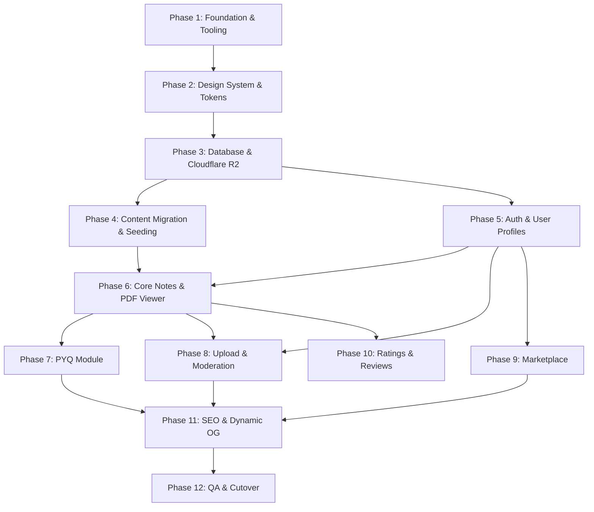

# Notes Nexus — v2 Migration Plan (Phase 0)

> Operational roadmap and dependency-ordered checklist for migrating Notes Nexus from a static single-department prototype to a multi-university, database-driven platform with Supabase, Cloudflare R2, Google Auth, Moderation, and Marketplace.

---

## 1. Branching & Deployment Strategy

To ensure zero downtime, `main` must remain untouched and connected to Vercel production (`notes-nexus-jisu.vercel.app`).

- **Production Branch (`main`)**: Serves the current stable static prototype. No breaking commits are pushed directly here.
- **Development Branch (`v2-rewrite`)**: The primary integration branch where the full v2 architecture is assembled.
- **Feature Branches (`feat/*`, `fix/*`)**: Scoped branches merged into `v2-rewrite` via pull requests.
- **Preview Staging**: Vercel preview deployments enabled for `v2-rewrite` with dedicated staging environment variables (`NEXT_PUBLIC_SUPABASE_URL`, staging R2 bucket).
- **Cutover**: Once end-to-end verification, accessibility audits, and seed data migration are verified on staging, `v2-rewrite` is merged into `main` with instant production cutover.

---

## 2. Technical Prerequisites

### A. What Must Happen Before a Database Can Be Introduced
1. **TypeScript Migration**: The current codebase uses loose JavaScript with `jsconfig.json`. Supabase database clients and queries require strongly typed schemas (generated via `supabase gen types typescript`) to eliminate runtime column typos and type mismatches.
2. **Environment Variable Architecture**: The current codebase has zero `.env` files and hardcodes URLs directly. An environment validation layer (e.g., using `zod` or `@t3-oss/env-nextjs`) must be installed before database connection strings or anon keys are introduced.
3. **Database Schema & Relational Design**: Designing the relational tables with foreign keys and indexes:
   - `universities` (id, name, slug, domain)
   - `departments` (id, university_id, name, slug, code)
   - `semesters` (id, number, label)
   - `subjects` (id, department_id, semester_id, name, slug, icon_name)
   - `materials` (id, subject_id, uploader_id, title, file_url, storage_key, type: 'note' | 'pyq', status: 'pending' | 'approved' | 'rejected', created_at)
   - `pyq_metadata` (id, material_id, exam_type: 'mid_sem' | 'end_sem', year: int)
4. **Row Level Security (RLS) Policies**: Define zero-trust security policies upfront so public users can read approved materials, authenticated students can create submissions, and moderators can inspect pending items.

### B. What Must Happen Before Authentication Can Be Introduced
1. **Google Cloud Console OAuth Setup**:
   - OAuth 2.0 Client ID and Secret configured with authorized redirect URIs for both Supabase Auth callback (`https://<project-ref>.supabase.co/auth/v1/callback`) and local development (`http://localhost:3000/auth/callback`).
2. **Next.js App Router Session Middleware (`middleware.ts`)**:
   - Install `@supabase/ssr` (replacing legacy auth helpers).
   - Implement Next.js edge middleware to read, refresh, and set auth cookies across server components, route handlers, and server actions.
3. **User Profiles Table with Role RBAC**:
   - Create a `profiles` table in Supabase triggered automatically on `auth.users` insertion via PostgreSQL function (`handle_new_user()`).
   - Define role enum: `student`, `moderator`, `admin`.
4. **Auth State UI Wireframes**:
   - Build login modal / Google SSO trigger and Navbar user menu dropdown (avatar, profile, role badge, logout action).

---

## 3. Structural Decisions in Current Code That Fight v2

The v2 rewrite must dismantle several architectural shortcuts present in the prototype:

1. **Flat Monolithic Routes vs. Hierarchical Segments**:
   - *Current*: `/notes` and `/pyq` are top-level flat routes serving only one department (JISU CSE).
   - *v2 Need*: Multi-university and multi-department support requires dynamic nested routes: `/[university]/[department]/notes` and `/[university]/[department]/pyq`.
2. **Client Component Inversion**:
   - *Current*: The entire pages (`notes/page.js`, `pyq/page.js`, `about/page.js`) are marked `"use client"` purely for local state or animation hooks, forcing metadata into separate dummy `layout.js` files.
   - *v2 Need*: Pages must be Server Components to stream data from Supabase, run server-side pagination, and export dynamic `generateMetadata()`. Client components must be pushed to the leaves (e.g. search bars, filter pills, interactive modals).
3. **Hardcoded Google Drive External Redirection**:
   - *Current*: Links are raw external URLs (`drive.google.com`) opened in new tabs with no tracking, no security, and no preview.
   - *v2 Need*: Files must live in Cloudflare R2, served through a secure in-app PDF viewer or presigned streaming URLs with download rate-limiting and virus/moderation scanning.
4. **Inline Styles Spaghetti & PostCSS Mismatch**:
   - *Current*: Tailwind is declared in `postcss.config.mjs` but omitted from CSS, while components use hundreds of inline `style={{ ... }}` lines.
   - *v2 Need*: Unified styling layer using Tailwind CSS v4 utility classes configured with the verified Neo-Brutalist design tokens.
5. **Hardcoded Institutional Identity**:
   - *Current*: "JIS University CSE Dept" is hardcoded in at least 15 files.
   - *v2 Need*: Academic institutions and departments must be dynamic entities fetched from the database.

---

## 4. Phased Migration Checklist

The following phases are strictly ordered by dependency. No phase should begin until the preceding phase's deliverables are verified.

---

### Phase 1: Foundation & Tooling Modernization
*Reasoning: Setting up TypeScript and clean CSS compilation prevents retrofitting types and styles onto broken components later.*

- [ ] **1.1 Branch Setup**: Create and checkout branch `v2-rewrite` from `main`. Configure Vercel preview deployment for this branch.
- [ ] **1.2 TypeScript Initialization**:
  - Install `typescript`, `@types/node`, `@types/react`, `@types/react-dom`.
  - Create `tsconfig.json` with strict type checking enabled (`"strict": true`).
  - Delete `jsconfig.json`.
- [ ] **1.3 Tailwind CSS v4 Integration**:
  - Add `@import "tailwindcss";` to `src/app/globals.css`.
  - Verify Tailwind 4 PostCSS pipeline compiles cleanly alongside custom Neo-Brutalist variables.
  - Remove dead `react-icons` dependency (standardize on `lucide-react`).
- [ ] **1.4 Environment Schema Validation**:
  - Create `src/env.mjs` or `src/lib/env.ts` using `zod` to validate all required environment variables:
    - `NEXT_PUBLIC_SUPABASE_URL`
    - `NEXT_PUBLIC_SUPABASE_ANON_KEY`
    - `SUPABASE_SERVICE_ROLE_KEY`
    - `R2_ACCOUNT_ID`, `R2_ACCESS_KEY_ID`, `R2_SECRET_ACCESS_KEY`, `R2_BUCKET_NAME`
    - `NEXT_PUBLIC_SITE_URL`
- [ ] **1.5 Clean Public Assets**:
  - Delete unrendered portrait files (`public/profilepic1.jpg` through `profilepic4.jpg`).
  - Compress `public/jis.png` (from 6000x3375 to max 900x600).
  - Replace oversized `public/favicon.png` (1563x1563) with standard 32x32/48x48 icon and SVG favicon.

---

### Phase 2: Design System & Neo-Brutalist Token Consolidation
*Reasoning: Neo-Brutalist components must be unified into clean, typed primitives so subsequent feature pages can be constructed rapidly without inline style duplication.*

- [ ] **2.1 Token Normalization (`globals.css`)**:
  - Define missing `--primary-green` variable (`#4ADE80` or `#22C55E`).
  - Fix accessibility failure on secondary buttons: change text color or pink shade to achieve WCAG AA 4.5:1 contrast.
  - Standardize box-shadow utilities: `.neo-shadow-sm` (2px), `.neo-shadow` (4px), `.neo-shadow-md` (6px), `.neo-shadow-lg` (8px), `.neo-shadow-xl` (10px).
- [ ] **2.2 Refactor UI Primitives (`src/components/ui/`)**:
  - `NeoButton.tsx`: Typed variants (`primary`, `secondary`, `outline`, `danger`), loading state spinner, disabled state, accessible `:focus-visible` styling.
  - `NeoCard.tsx`: Polymorphic card container with flexible header, customizable background, and body slots (eliminating the rigid 160px yellow header constraint).
  - `NeoInput.tsx`: Accessible input component with clear focus ring, label support, and error helper text.
  - `NeoBadge.tsx`: Reusable rotated tags (`-2deg`, `+1deg`) for department pills and status badges.
- [ ] **2.3 Accessible Navigation Header (`Navbar.tsx`)**:
  - Eliminate the fixed 100px spacer hack; implement dynamic height layout.
  - Single source of truth for navigation links (array mapping).
  - Accessible mobile drawer with focus trap, body scroll lock, and ARIA attributes (`aria-expanded`, `aria-controls`).
  - Add auth slot (Login button or User avatar dropdown).
- [ ] **2.4 Site Footer (`Footer.tsx`)**:
  - Implement a persistent Neo-Brutalist footer across all pages with university links, team credits, feedback form, and copyright.

---

### Phase 3: Database & Cloudflare R2 Architecture
*Reasoning: Database tables, indexes, and storage buckets must exist before content migration or user uploads can be coded.*

- [ ] **3.1 Supabase Project & Migrations**:
  - Initialize Supabase CLI migrations (`supabase/migrations/`).
  - Create core tables: `universities`, `departments`, `semesters`, `subjects`, `materials`, `pyq_metadata`, `profiles`, `marketplace_items`, `ratings`.
  - Create database triggers for `profiles` creation on user signup.
- [ ] **3.2 Row Level Security (RLS)**:
  - Write granular RLS policies for public reading of approved content.
  - Write student policies for insert operations into `materials` with status `'pending'`.
  - Write moderator/admin policies for updating material status.
- [ ] **3.3 Cloudflare R2 Integration**:
  - Create R2 bucket for study materials (`notes-nexus-files`).
  - Implement S3 client utility (`src/lib/r2.ts`) using `@aws-sdk/client-s3`.
  - Implement secure presigned upload URL generator for user contributions.
  - Implement presigned streaming URL generator for PDF viewing.

---

### Phase 4: Data Extraction & Seeding
*Reasoning: Migrating the existing 59 subjects into the database ensures no legacy academic data is lost.*

- [ ] **4.1 Seed Script Creation (`scripts/seed-legacy-data.ts`)**:
  - Write an idempotent TypeScript seed script using `@supabase/supabase-js`.
  - Seed initial university (`JIS University`, slug `jisu`).
  - Seed initial department (`Computer Science and Engineering`, code `CSE`).
  - Seed all 8 semesters.
  - Seed all 59 subjects extracted in Phase 0 audit, linking the 15 valid Drive folders and flagging the 44 placeholder subjects.
- [ ] **4.2 Drive-to-R2 Migration Path**:
  - Document a utility script to download files from the 15 valid Google Drive folders and upload them directly into Cloudflare R2 with corresponding `materials` database records.

---

### Phase 5: Authentication & User Profiles
*Reasoning: Auth is required to enable user contributions, the moderation pipeline, and the marketplace.*

- [ ] **5.1 Supabase SSR Middleware**:
  - Configure `middleware.ts` with `createServerClient` from `@supabase/ssr` to handle automatic cookie-based session refreshment.
- [ ] **5.2 Google OAuth Authentication Flow**:
  - Implement OAuth callback route handler (`src/app/auth/callback/route.ts`).
  - Implement sign-in and sign-out server actions.
  - Implement Login Modal and Navbar User Avatar component.
- [ ] **5.3 User Profile Management**:
  - Build user profile view (`/profile`) displaying student submissions, saved bookmarks, and marketplace listings.

---

### Phase 6: Academic Resource Engine & Secure PDF Viewer
*Reasoning: Core value proposition of the site. Replaces client-side 59-subject array with server-rendered database views.*

- [ ] **6.1 Dynamic Routes (`src/app/[university]/[department]/notes/`)**:
  - Implement Server Component page fetching subjects by department and semester.
  - Implement dynamic metadata (`generateMetadata`) for SEO.
- [ ] **6.2 Leaf Client Search & Filtering**:
  - Build debounced search and semester filter tabs as lightweight client components updating URL query params.
- [ ] **6.3 Subject Detail & Notes View (`.../notes/[subjectSlug]/`)**:
  - Display all approved modules, lecture notes, and cheat sheets for a subject.
- [ ] **6.4 Secure PDF Viewer**:
  - Implement in-browser PDF viewer (using PDF.js or React-PDF) with print/copy protections if required by policy.
  - Stream PDFs through secure Cloudflare R2 presigned URLs.

---

### Phase 7: Previous Year Questions (PYQ) Engine
*Reasoning: Replaces the 16 dead `#` buttons with an actual examination archive.*

- [ ] **7.1 Dynamic PYQ Routes (`.../pyq/`)**:
  - Server Component displaying semesters 1 through 8 with real paper counts.
- [ ] **7.2 Paper Selection & Exam Type Filter**:
  - Semester view allowing students to toggle between Mid Sem and End Sem papers.
  - Filter by year (e.g. 2022, 2023, 2024, 2025).
  - One-click launch into the secure PDF viewer.

---

### Phase 8: Open Moderated Contribution Pipeline
*Reasoning: Allows students to submit notes and PYQs, unlocking platform growth while preventing spam.*

- [ ] **8.1 Contribution Form (`/contribute` or `/upload`)**:
  - Multi-step Neo-Brutalist upload wizard: select university, department, semester, subject, material type (`note` or `pyq`), title, and PDF file.
  - Client-side validation: file size limits (max 50 MB), PDF mime-type verification.
  - Direct-to-R2 upload via presigned PUT URLs (bypassing Vercel 4.5 MB payload limit).
- [ ] **8.2 Moderation Dashboard (`/admin/moderation`)**:
  - Role-protected route accessible only to `moderator` and `admin` profiles.
  - Side-by-side PDF preview with one-click "Approve" or "Reject with Reason".
  - Automated status update triggering material publication in the public catalog.

---

### Phase 9: Second-Hand Student Marketplace
*Reasoning: High-engagement student feature for textbooks, drafters, calculators, and lab coats.*

- [ ] **9.1 Marketplace Catalog (`/marketplace`)**:
  - Grid of student listings with item image, price, condition (New, Good, Fair), and university tag.
  - Search and category filtering (Books, Electronics, Lab Gear, Miscellaneous).
- [ ] **9.2 Listing Creation & Management**:
  - Create listing form with image upload to R2.
  - Edit/Mark as Sold controls for listing owner.
- [ ] **9.3 Buyer-Seller Contact Flow**:
  - Secure WhatsApp / email contact modal without exposing student phone numbers to web scrapers.

---

### Phase 10: Ratings, Reviews & Social Proof
*Reasoning: Improves academic resource quality through community feedback.*

- [ ] **10.1 Rating Component**:
  - Neo-Brutalist 5-star rating widget on note detail pages.
  - RLS policy: one vote per authenticated student per material.
- [ ] **10.2 Quality Badges**:
  - "Top Rated" and "Faculty Verified" badges on notes with high ratings.
- [ ] **10.3 Flagging & Report Flow**:
  - Report button on study materials and marketplace listings for immediate moderator review.

---

### Phase 11: SEO, Dynamic OpenGraph & Web Vitals
*Reasoning: Maximizes discoverability and social sharing across WhatsApp university groups.*

- [ ] **11.1 Dynamic Sitemap (`src/app/sitemap.ts`)**:
  - Query Supabase to dynamically index all universities, departments, subjects, and approved materials.
- [ ] **11.2 Edge OpenGraph Card Generator (`src/app/api/og/route.tsx`)**:
  - Refactor `opengraph-image` to accept dynamic query parameters: title, department, university, and material count.
  - Eliminate external image network requests during OG generation.
- [ ] **11.3 Performance & Core Web Vitals**:
  - Ensure all Next.js Server Components stream with React Suspense.
  - Add explicit `loading.tsx` and `error.tsx` boundaries to every dynamic route folder.

---

### Phase 12: Hardening, Accessibility, QA & Cutover
*Reasoning: Ensures platform stability, legal compliance, and a seamless switchover from v1.*

- [ ] **12.1 Accessibility & WCAG AA Audit**:
  - Verify all color contrast ratios meet or exceed 4.5:1.
  - Audit keyboard navigation across all modals, drawers, and form elements.
  - Verify full screen-reader announcements for icons, avatar badges, and status pills.
- [ ] **12.2 End-to-End Test Suite**:
  - Automated Playwright/Cypress tests for critical user flows:
    - Google login -> Profile creation.
    - Note browsing -> PDF viewer opening.
    - Student file upload -> Moderator approval -> Public catalog display.
    - Marketplace item listing -> Detail view.
- [ ] **12.3 Production Cutover**:
  - Run database migrations on Supabase production.
  - Execute final legacy seed script on production.
  - Configure production environment variables on Vercel.
  - Merge `v2-rewrite` into `main`.
  - Verify live DNS and traffic on `notes-nexus-jisu.vercel.app`.
