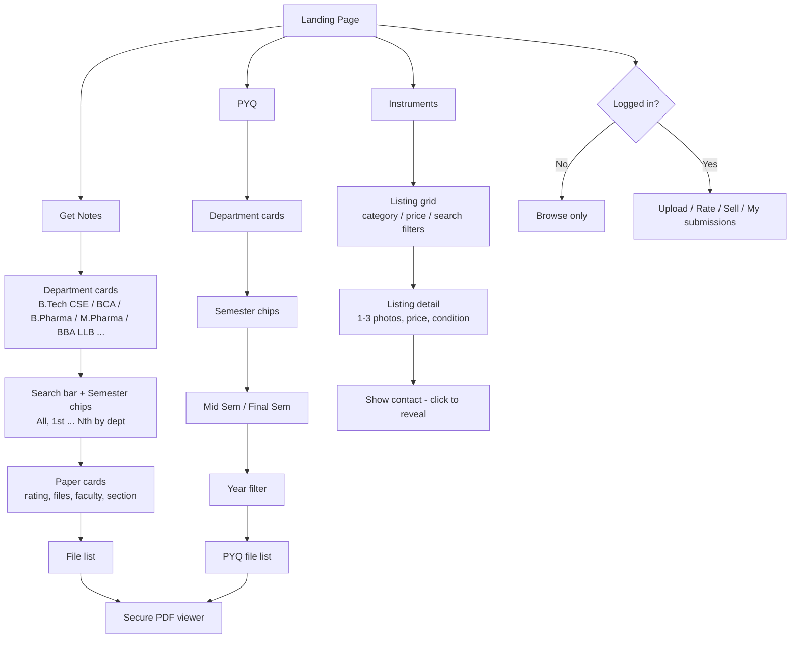
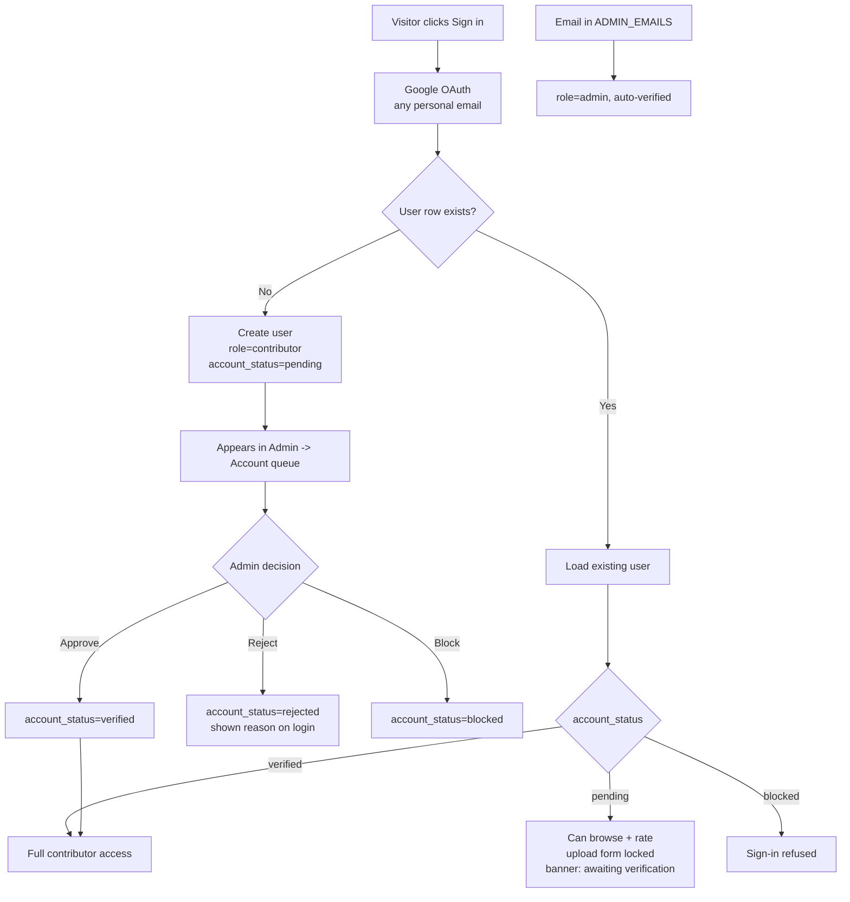
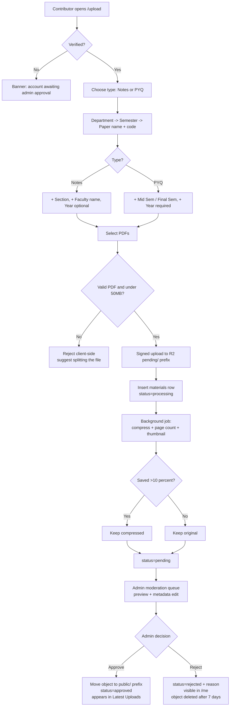
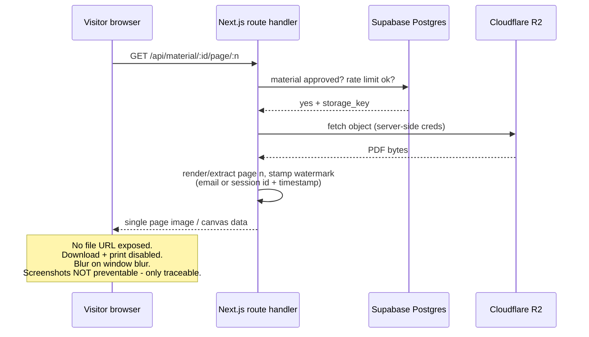
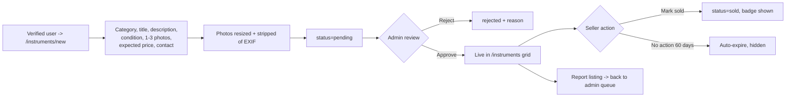

# Notes Nexus v2 — Project Brief / Build Spec

**Important framing:** this is a **student-run, unofficial** project. It is not an official JIS University website and carries no authority from the college. There is no access to university email records or student databases, so all identity handling is self-managed via Google OAuth on personal email addresses. Copy, footer and About page must make the unofficial status clear ("A student initiative. Not affiliated with or endorsed by the university."), and use of the university logo/name should be minimal and non-implying.

---

## 1. What exists today

- Live site: `https://notes-nexus-jisu.vercel.app/` — Next.js app deployed on Vercel.
- Scope: **JIS University, CSE department only**.
- Pages: Home, Notes, PYQ, About, Feedback (external Google Form).
- Notes page = a flat list of ~60 subject cards ("Engineering Mathematics-1", "Machine Learning", …). Each card has a generic one-line description and a **"View Notes" link that points to a Google Drive folder**. Many are still `demo_link` placeholders.
- No database, no auth, no upload flow. Content is added by editing code / Drive links. Only admins can add anything.
- Visual identity: dark hero, university photo, uppercase nav (HOME / NOTES / PYQ / ABOUT / FEEDBACK), "GET NOTES" + "LEARN MORE" CTA buttons, "LATEST UPLOADS" list.

## 2. What v2 must become

A **university-wide** study-material platform with real storage, real database, open (but moderated) contributions, and a second-hand marketplace.

Changes at a glance:

| Area | v1 (now) | v2 (target) |
|---|---|---|
| Scope | CSE dept | All departments (B.Tech CSE, BCA, B.Pharma, M.Pharma, BBA LLB, …) |
| File storage | Google Drive links | Own free-tier object storage, PDFs served by the app |
| Content model | Hardcoded subject list | Database: departments → semesters → papers → files |
| Who uploads | Admins only | Anyone with a Google login (account verified once by admin, **every upload** verified) |
| Who reads | Anyone | Anyone, **no login required** |
| Viewing | Drive viewer (downloadable) | In-app PDF viewer, download disabled, screenshot-deterred |
| Features | Notes, PYQ | Notes, PYQ, **Instruments (second-hand marketplace)**, search, semester filters, ratings |
| Name | "Notes Nexus" | Placeholder — will be renamed later, so **keep the brand name in one config/constants file**, never hardcoded across components |

## 3. Roles and auth model

1. **Visitor (not logged in)** — browse, search, filter, view PDFs inline, browse marketplace listings. *No account needed.* Clicking the star rating shows a "Sign in to rate" prompt rather than a disabled control.
2. **Contributor (Google OAuth login, any personal Gmail)** — rate materials (one vote per account), upload notes / PYQ, create marketplace listings, see the status of their own submissions (pending / approved / rejected + reason). First-time accounts sit in a `pending` state until an admin approves the account.
3. **Admin** — approve/reject accounts, approve/reject every uploaded file, approve/reject marketplace listings, edit metadata, delete content, manage departments/semesters/papers, view a moderation queue and basic analytics.

**Admins are a fixed allowlist of three emails** (the founder + two friends), supplied later. Store them in a server-side env var (`ADMIN_EMAILS=a@gmail.com,b@gmail.com,c@gmail.com`) *and* mirror the role in the `users` table on first login, so RLS policies can key off the DB role rather than the env var at query time. There is no self-service path to becoming an admin.

**No email-domain restriction.** Any Google account can sign up, so the first-login account-verification step is the only spam gate — build it properly: the admin queue should show name, email, avatar and signup time, with approve / reject / block actions.

**Two-stage verification is required:** account verification happens once; upload verification happens for every single upload, even from already-verified contributors. Nothing is publicly visible before admin approval.

## 4. Information architecture

```
/                       Landing: 3 big entry cards → Get Notes | PYQ | Instruments
/notes                  Department picker (cards: B.Tech CSE, BCA, B.Pharma, M.Pharma, BBA LLB, …)
/notes/[dept]           Search bar + semester filter chips (All, 1st…8th, per that dept's duration)
                        → paper cards with rating, uploader, faculty, file count
/notes/[dept]/[paper]   File list for that paper → opens in-app PDF viewer
/pyq                    Department picker
/pyq/[dept]             Semester filter → each semester splits into Mid Sem | Final Sem
                        → year filter (2024, 2023, …) → paper cards
/pyq/[dept]/[paper]     File list → in-app PDF viewer
/instruments            Marketplace grid: books / lab instruments, search + category + price filters
/instruments/[id]       Listing detail: 1–3 photos, expected price, seller name + contact
/instruments/new        Create listing (login required)
/upload                 Upload notes or PYQ (login required)
/me                     My uploads / my listings + their approval status
/admin                  Moderation queue (accounts, files, listings) + taxonomy management
/about                  About page (keep, refresh copy for university-wide scope)
```

Note the department-driven semester count: a 4-year B.Tech has 8 semesters, BCA 6, M.Pharma 4, BBA LLB 10. **Semester count must be a property of the department, not a global constant.**

## 5. Data model (Postgres / Supabase)

```
departments      id, name, short_code, degree_type, total_semesters, icon, sort_order, is_active
papers           id, department_id, semester, paper_name, paper_code, is_active
                 (unique on department_id + semester + paper_code)
users            id, google_id, email, name, avatar_url, role (visitor|contributor|admin),
                 account_status (pending|verified|blocked), created_at, verified_by, verified_at
materials        id, type (notes|pyq), department_id, paper_id, semester,
                 paper_name, paper_code,            -- denormalised for search
                 section        (notes only, nullable)
                 faculty_name   (notes only, nullable)
                 exam_type      (pyq only: mid_sem|final_sem)
                 year           (int, required for pyq, optional for notes)
                 title, description,
                 storage_key, file_size, page_count, mime_type,
                 uploaded_by, status (pending|approved|rejected), reject_reason,
                 reviewed_by, reviewed_at, view_count, created_at
ratings          id, material_id, user_id, stars (1-5), created_at   (unique material_id+user_id)
listings         id, seller_id, category (book|instrument|other), title, description,
                 condition, expected_price, is_negotiable,
                 photo_keys (array, 1–3), contact_name, contact_phone, contact_email,
                 status (pending|approved|rejected|sold), reject_reason, created_at, expires_at
audit_log        id, actor_id, action, entity_type, entity_id, meta, created_at
```

Derive an average rating either as a materialised column on `materials` (`rating_avg`, `rating_count`, updated by trigger) or a view — needed because notes are sorted/filtered by rating.

## 6. Upload flow (contributor)

Form fields, validated per type:

- **Both:** Department → Semester → Paper name → Paper code → file(s) (PDF only, **max 50 MB each**, multiple allowed)
- **Notes only:** Section, Faculty name
- **PYQ only:** Exam type (Mid Sem / Final Sem), Year
- **Year** is also offered (optional) for notes.

Behaviour: department and semester selections cascade to filter the paper list; if the paper doesn't exist yet the contributor can type a new paper name + code, which creates a `pending` paper the admin confirms. Client-side PDF validation (magic bytes, page count, not encrypted). On submit → file goes to storage in a `pending/` prefix, row created with `status=pending`, contributor sees "submitted for review". Admin approval moves the object to the public prefix and flips status.

**Post-upload compression (required).** After the raw file lands in `pending/`, run a server-side lossless-to-light compression pass before it is served:

- Use **Ghostscript** (`-dPDFSETTINGS=/ebook`, ~150 DPI image downsampling) or **qpdf** (`--object-streams=generate --compress-streams=y`) — Ghostscript for scanned/image-heavy PDFs, qpdf for text PDFs where re-rasterising would hurt.
- Target: meaningful size reduction with handwritten notes still comfortably legible. Keep it *slight* — students must be able to read scanned handwriting, so do not go below ~150 DPI.
- Store both `original_size` and `compressed_size` on the row; if compression saves less than ~10% or the output is larger, **keep the original** and log it.
- Run it in a background job (Vercel cron / a queue / Supabase Edge Function) rather than blocking the upload response, and mark the row `processing → pending` when done. Note that Ghostscript is not available in the default Vercel serverless runtime — either use a Docker-based worker, a separate small VPS/Railway service, or a WASM PDF library. Flag this to the developer as a deployment decision.
- Cap: reject files over 50 MB **before** upload starts (client check + server check), with a clear message suggesting the contributor split the file by unit/chapter.

## 7. Free backend storage — recommendation

**Recommended: Cloudflare R2 for files + Supabase for database and auth.**

- **Cloudflare R2** — S3-compatible object storage, generous free tier and, critically, **no egress fees**, which matters because a notes site is read-heavy. Serve PDFs through signed, short-lived URLs (or proxy them through a Next.js route handler) so the raw object URL is never exposed.
- **Supabase** — free Postgres + Google OAuth + Row Level Security; also has its own storage bucket if you'd rather keep everything in one place (smaller free quota than R2).
- Alternatives worth comparing: **Appwrite Cloud**, **Backblaze B2** (needs Cloudflare in front to avoid egress cost), **UploadThing**, **ImageKit** (good for the marketplace photos specifically, since it does image optimisation).
- Avoid: Firebase Storage (now requires a billing account), storing PDFs in a Git repo, and staying on Google Drive (no access control granularity, and Drive's viewer always offers download).

⚠️ Free-tier quotas and terms change often — verify current limits on each provider's pricing page before committing.

## 8. Privacy: "no download, no screenshot" — read this carefully

- **Download can be effectively blocked.** Render PDFs with PDF.js into `<canvas>` (or pre-convert each page to a watermarked WebP/image on approval), never expose the file URL, serve bytes only through an authenticated/signed route, disable the PDF.js download + print buttons, block right-click and `Ctrl/Cmd+S/P`. A determined user can still capture the rendered pages, but casual downloading stops.
- **Screenshots cannot be blocked on the web.** There is no browser API that prevents a screenshot, and no CSS/JS trick that survives OS-level capture, a second device, or devtools. Any library claiming otherwise only deters. Do not promise students that screenshots are impossible.
- What actually works as a deterrent, and what this spec asks for:
  - Canvas-based rendering, page-by-page, no full-file blob in memory.
  - A **per-viewer dynamic watermark** overlaid on every page: the logged-in email or, for anonymous visitors, a session ID + timestamp. This makes leaks traceable and is the single most effective measure.
  - `user-select: none`, disabled context menu, blur the viewer on `visibilitychange` / window blur (defeats some automated capture tools and screen recorders).
  - Rate-limit page requests per session to make bulk scraping slow.
  - On Android/iOS, if a wrapper app is ever built, `FLAG_SECURE` / screenshot detection is available — mention this only as a future option.
- Be explicit in the UI: "Materials are view-only. Watermarked with your session ID." Honesty beats a false guarantee.

## 9. Instruments / second-hand marketplace

- Create listing (login required): category (book / lab instrument / other), title, description, condition, **1–3 photos**, **expected price** (₹), negotiable toggle, contact name, contact phone, optional email.
- Every listing is **admin-verified before going live** — this is the fraud and spam gate.
- Listing detail page shows photos, price, condition, seller name and contact. Consider revealing the phone number only on a click ("Show contact") to reduce scraping, and add a "Report listing" button.
- Seller can mark a listing **Sold**; listings auto-expire after ~60 days to keep the board fresh.
- Grid filters: category, price range, semester/department relevance, newest first.
- Add a short disclaimer: the platform only lists items and is not a party to any transaction.

## 10. UI/UX direction

**Keep the existing theme** — same colour language, dark hero, uppercase nav, the existing logo and JIS imagery — but raise the execution:

- Landing page rebuilt around **three equal entry cards** (Get Notes / PYQ / Instruments) with icons, replacing the single "GET NOTES" CTA. Keep "Latest Uploads" as a live feed from the database.
- Department cards: consistent icon + degree type + semester count, grid layout, hover elevation.
- Replace the current wall of 60 identical subject cards with **search-first browsing**: sticky search bar, semester filter chips, sort by rating / newest / most viewed, and skeleton loaders while fetching.
- Paper cards should show real signal: rating stars + count, number of files, faculty, semester badge, uploader name, upload date.
- Empty states, error states, and a clear pending/approved badge system for contributors.
- Fully responsive and mobile-first — most students will open this on a phone.
- Accessible: real focus states, keyboard-navigable filters, sufficient contrast, alt text on images.
- Use consistent spacing and type scale tokens rather than ad-hoc values; keep brand name, colours and department list in a single config so the rename is a one-file change.

## 11. Suggested stack

- **Next.js (App Router) + TypeScript + Tailwind CSS** — matches the current site.
- **Supabase**: Postgres + Auth (Google provider) + Row Level Security.
- **Cloudflare R2** for PDFs and listing photos, accessed via the S3 SDK from server-side route handlers only.
- **PDF.js** (`react-pdf` or direct) for the canvas viewer; `sharp` for photo resizing; `zod` for form validation; `shadcn/ui` for accessible primitives if a component library is wanted.
- Deployment stays on **Vercel**. All storage/DB credentials in server-side env vars — never in client components.

## 12. Build order

1. **Foundation** — Supabase schema + seed departments/semesters/papers; Google OAuth; roles and RLS.
2. **Read path** — landing page with 3 cards, department pickers, notes/PYQ browsing with search + filters, migrate existing Drive content into R2.
3. **Secure viewer** — proxied PDF streaming, canvas renderer, watermarking, download/print disabled.
4. **Write path** — upload form, pending states, `/me` dashboard.
5. **Admin** — moderation queue for accounts, files and listings; taxonomy management; audit log.
6. **Ratings** — one vote per account, aggregate display, sort-by-rating.
7. **Marketplace** — listing creation, photo upload, moderation, grid + detail pages, sold/expiry.
8. **Polish** — analytics, rename/rebrand, SEO, mobile QA.

## 13. Settled decisions

| Question | Decision |
|---|---|
| Official university project? | **No.** Student-run, unofficial, no college authority. Must be stated in the UI. |
| Email domain restriction | **None.** Any personal Google account can register; no university email records exist to check against. |
| Ratings | **Login required**, one vote per account, 1–5 stars. |
| Max file size | **50 MB per PDF**, hard-rejected above that. |
| Compression | **Yes**, slight server-side compression after upload; keep the original if the saving is negligible. |
| Admins | **Three fixed accounts** (founder + 2 friends), emails supplied later, stored in an env allowlist + DB role. No per-department moderators for now. |
| Copyright | **Not a concern at this stage.** (Still worth adding a plain "Report content" link later — it costs almost nothing and gives an exit if a faculty member ever objects.) |

Still worth thinking about at some point, but not blocking: storage budget per semester once real usage starts, whether to add per-department moderators as volume grows, and what happens to admin access after the three of you graduate.

---

## 14. Flow diagrams

### 14.1 Site navigation



### 14.2 Auth and account verification



> Decision to make here: can a `pending` account rate and browse but not upload (recommended — lower friction), or is it locked out entirely until approved? Spec assumes the former.

### 14.3 Upload → moderation → publish



### 14.4 Secure PDF viewing



### 14.5 Marketplace listing lifecycle



---

## 15. Step-by-step process for Antigravity

Work in this order, one phase per session, committing after each. Do **not** let the agent attempt the whole spec in one run — it will produce a large unreviewable diff. After each phase, run the app and check the phase's acceptance criteria before moving on.

### Phase 0 — Analyse and plan
1. Open the existing repo in Antigravity.
2. Run the codebase-analysis prompt (separate file: `antigravity-codebase-analysis-prompt.md`).
3. Ask it to write `docs/ARCHITECTURE.md` and `docs/MIGRATION-PLAN.md` from its findings, plus a list of every file that hardcodes content or the brand name.
4. Create a `v2` branch. Keep `main` deployed and working throughout.
**Done when:** you have a written map of the current code and a migration plan you actually agree with.

### Phase 1 — Config and design tokens
1. Extract the brand name, tagline, logo path, colours, type scale and spacing into `src/config/site.ts` and Tailwind theme tokens. One-file rename later.
2. Move the department list into `src/config/departments.ts` (name, short code, degree type, total semesters, icon) as the seed source of truth.
3. Refactor existing pages to read from config instead of hardcoded strings.
**Done when:** changing the brand name in one file updates every page, and no component contains a literal department name.

### Phase 2 — Database and auth
1. Create the Supabase project. Write `supabase/migrations/0001_init.sql` from section 5's schema.
2. Seed departments, semesters and the existing ~60 CSE papers.
3. Add Row Level Security: public read of `status=approved` only; insert restricted to `account_status=verified`; all writes to other people's rows admin-only.
4. Wire Google OAuth (no domain restriction). Implement the users table sync, the `ADMIN_EMAILS` allowlist, and the pending/verified/blocked states.
5. Add `middleware.ts` route protection for `/upload`, `/me`, `/admin`.
**Done when:** you can sign in with a personal Gmail, land in `pending`, and one of the three admin emails lands as `admin` automatically.

### Phase 3 — Read path (highest user value, ship early)
1. Rebuild the landing page around three entry cards (Get Notes / PYQ / Instruments), keeping the current theme. "Latest Uploads" reads from the DB.
2. Build `/notes` and `/pyq` department pickers from the DB.
3. Build `/notes/[dept]` with a sticky search bar, semester filter chips (count driven by `total_semesters`), and sort by rating / newest / most viewed. Skeleton loaders, empty states.
4. Build `/pyq/[dept]` with semester → mid/final → year filtering.
5. Build the paper detail / file list pages.
**Done when:** browsing works end to end on mobile and desktop against seeded data, with no login.

### Phase 4 — Storage and secure viewer
1. Set up the Cloudflare R2 bucket with `pending/` and `public/` prefixes. Credentials server-side only.
2. Build the upload route (presigned PUT) and the streaming read route handler.
3. Build the PDF.js canvas viewer: no download button, no print, context menu blocked, `Ctrl/Cmd+S/P` intercepted, `user-select: none`, blur on window blur.
4. Add the per-page dynamic watermark (email for logged-in users, session ID + timestamp for anonymous) and per-session rate limiting.
5. Migrate existing Drive PDFs into R2 and attach them to the seeded papers.
**Done when:** a PDF opens page by page, the network tab shows no reusable file URL, and the watermark carries the viewer's identity.

### Phase 5 — Write path
1. Build `/upload` with the cascading form and per-type conditional fields from section 6.
2. Add Zod validation, the 50 MB client + server check, and the "create new paper as pending" path.
3. Build the background compression job and the `processing → pending` transition.
4. Build `/me` showing each submission's status and rejection reason.
**Done when:** a verified contributor can upload a 40 MB scan, see it compress, and watch it sit as pending.

### Phase 6 — Admin
1. Build `/admin` with three queues: accounts, materials, listings.
2. Materials queue needs inline PDF preview and editable metadata before approval — contributors will get fields wrong.
3. Implement approve (move object to `public/`), reject with reason, block user, delete.
4. Add the audit log and a small dashboard (pending counts, uploads this week, top papers).
**Done when:** you can clear a queue of mixed submissions without touching the database directly.

### Phase 7 — Ratings
1. Star control on paper/file cards; anonymous click opens the sign-in prompt.
2. One row per `(material_id, user_id)`, enforced by a unique constraint, upsert on change.
3. Trigger maintaining `rating_avg` and `rating_count`; wire the sort-by-rating option.
**Done when:** the same account cannot inflate a rating by voting twice.

### Phase 8 — Marketplace
1. `/instruments` grid with category, price range and search filters.
2. `/instruments/new` with 1–3 photo upload, resize + EXIF strip, price, condition, contact fields.
3. Detail page with click-to-reveal contact and a report button.
4. Sold toggle, 60-day auto-expiry (cron), moderation queue integration, transaction disclaimer.
**Done when:** a listing goes pending → approved → live → sold without manual DB edits.

### Phase 9 — Polish and launch
1. Unofficial-project disclaimer in footer and About; refresh About copy for university-wide scope.
2. Replace the Google Form feedback link with an in-app form (or keep it — not worth the effort now).
3. SEO metadata per department/paper, sitemap, OG images.
4. Mobile QA on real phones, Lighthouse pass, accessibility pass (focus states, keyboard filters, contrast, alt text).
5. Rename/rebrand via `site.ts` when the new name is chosen.
6. Error monitoring (Sentry free tier) and a simple analytics tool.
**Done when:** you would be comfortable sharing the link in a university-wide group chat.

### Rules for the agent, in every session
- Never commit secrets; all storage/DB credentials in server-side env vars only.
- No R2 or admin operation from a client component.
- TypeScript strict, no `any` in new code.
- Keep the existing visual theme; improve execution, don't restyle from scratch.
- Change one phase's scope per session; ask before touching files outside it.
- Write the migration SQL as a file, never as an ad-hoc dashboard change.

---

## 16. Team / About section changes

The About page team cards keep their **exact current design** — thick black border, hard offset shadow, initials block on top, name + social icons below, barcode strip at the bottom, alternating white / blue (`#6BA6F7`-ish) initials panels. Only the roster and the icon set change.

### Roster

Order matters — Kumaresh Jana is first.

| # | Name | LinkedIn | GitHub | Instagram |
|---|---|---|---|---|
| 1 | **Kumaresh Jana** | `https://www.linkedin.com/in/kumaresh-jana-050406k` | `iamkumaresh` | `__kumares_h`, `_kumares_h` |
| 2 | **Rajdip Garai** | *(keep existing link from current site)* | *(keep existing)* | `rajdipgarai_` |
| 3 | **Souvik Das** | *(keep existing link from current site)* | *(keep existing)* | `das_ouvik` |

**Removed:** Saikat Das and Pritam Bhattacharjee — delete their cards and any associated assets/links entirely.

Verify Rajdip's and Souvik's exact display names and existing LinkedIn/GitHub URLs against the current About page code rather than retyping them.

### Implementation notes

- Put the roster in `src/config/team.ts` as a typed array, so adding or reordering a member is a one-file change:

```ts
export type TeamMember = {
  name: string;
  initials: string;          // fallback when no photo
  photo?: string;            // real photos to be added later
  accent: "white" | "blue";  // alternating card panel
  socials: { linkedin?: string; github?: string; instagram?: string[] };
};
```

- **Instagram icon:** add a third icon alongside LinkedIn and GitHub, matching the existing solid-black glyph weight and size. Kumaresh has two handles — either render two Instagram icons or link the primary (`__kumares_h`) and skip the second. Recommend linking only the primary to keep the card clean; keep the second in config.
- **Photos:** keep the initials block as-is for now. Make the card render `photo` when present and fall back to `initials` when absent, so dropping in the real images later needs no component changes. Reserve the same square aspect ratio the initials panel uses so nothing shifts.
- The `accent` value should alternate automatically from array index rather than being hardcoded per person, so removing a member doesn't break the white/blue rhythm.
- All social links: `target="_blank" rel="noopener noreferrer"`, plus `aria-label` (e.g. "Kumaresh Jana on GitHub") — the icons carry no text.

### Antigravity prompt for this change

> In `src/config/team.ts`, create a typed team roster and refactor the About page team cards to render from it. Keep the existing card design exactly as is: black border, offset shadow, initials panel, name, social icon row, barcode strip, alternating white/blue panels driven by array index.
>
> Roster, in this order: (1) Kumaresh Jana — LinkedIn `https://www.linkedin.com/in/kumaresh-jana-050406k`, GitHub `iamkumaresh`, Instagram `__kumares_h`; (2) Rajdip Garai — keep his existing LinkedIn and GitHub from the current code, add Instagram `rajdipgarai_`; (3) Souvik Das — keep his existing LinkedIn and GitHub from the current code, add Instagram `das_ouvik`.
>
> Remove the Saikat Das and Pritam Bhattacharjee cards and any unused assets or links they leave behind.
>
> Add an Instagram icon matching the existing LinkedIn/GitHub glyph weight and size. Add an optional `photo` field to each member and make the card render the photo when present, falling back to the initials panel when absent, with the same square aspect ratio so no layout shift occurs later. Add `aria-label` to every social link and `rel="noopener noreferrer"` on all external links.
>
> Read the current About page component first and report the existing member data you found before changing anything.
 